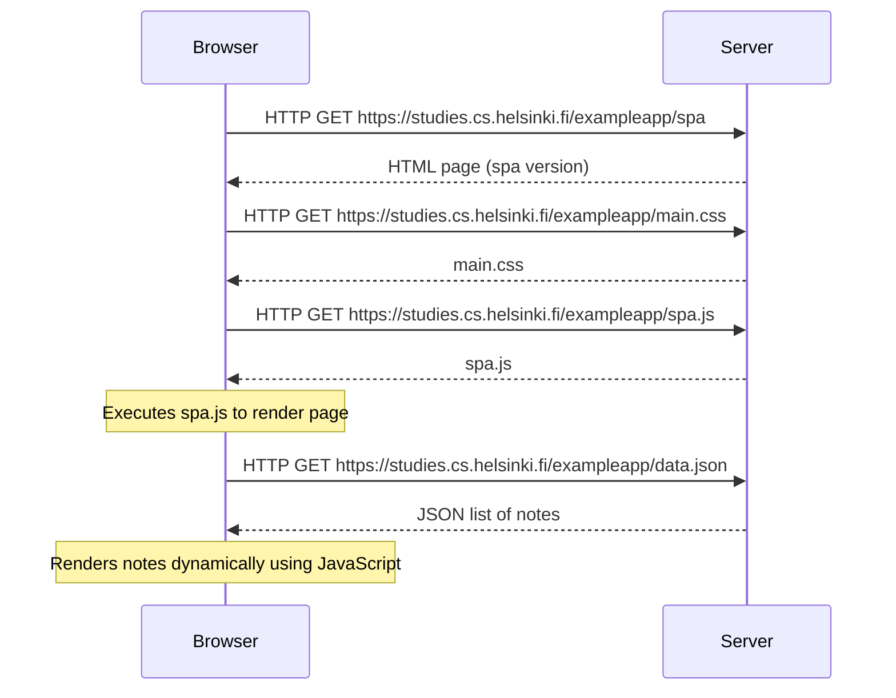

```mermaid
sequenceDiagram
    participant Browser
    participant Server

    Browser->>Server: HTTP GET https://studies.cs.helsinki.fi/exampleapp/spa
    Server-->>Browser: HTML page (spa version)

    Browser->>Server: HTTP GET https://studies.cs.helsinki.fi/exampleapp/main.css
    Server-->>Browser: main.css

    Browser->>Server: HTTP GET https://studies.cs.helsinki.fi/exampleapp/spa.js
    Server-->>Browser: spa.js

    Note over Browser: Executes spa.js to render page

    Browser->>Server: HTTP GET https://studies.cs.helsinki.fi/exampleapp/data.json
    Server-->>Browser: JSON list of notes

    Note over Browser: Renders notes dynamically using JavaScript
```