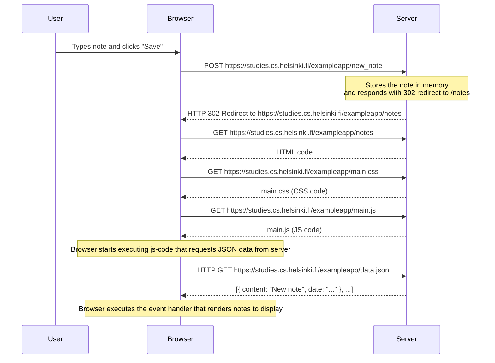

```mermaid
sequenceDiagram
    participant User
    participant Browser
    participant Server

    User->>Browser: Types note and clicks "Save"
    Browser->>Server: POST https://studies.cs.helsinki.fi/exampleapp/new_note
    Note over Server: Stores the note in memory<br/>and responds with 302 redirect to /notes
    Server-->>Browser: HTTP 302 Redirect to https://studies.cs.helsinki.fi/exampleapp/notes
    Browser->>Server: GET https://studies.cs.helsinki.fi/exampleapp/notes
    Server-->>Browser: HTML code
    Browser->>Server: GET https://studies.cs.helsinki.fi/exampleapp/main.css
    Server-->>Browser: main.css (CSS code)
    Browser->>Server: GET https://studies.cs.helsinki.fi/exampleapp/main.js
    Server-->>Browser: main.js (JS code)

    Note over Browser: Browser starts executing js-code that requests JSON data from server
    Browser->>Server: HTTP GET https://studies.cs.helsinki.fi/exampleapp/data.json
    Server-->>Browser: [{ content: "New note", date: "..." }, ...]
    Note over Browser: Browser executes the event handler that renders notes to display
```