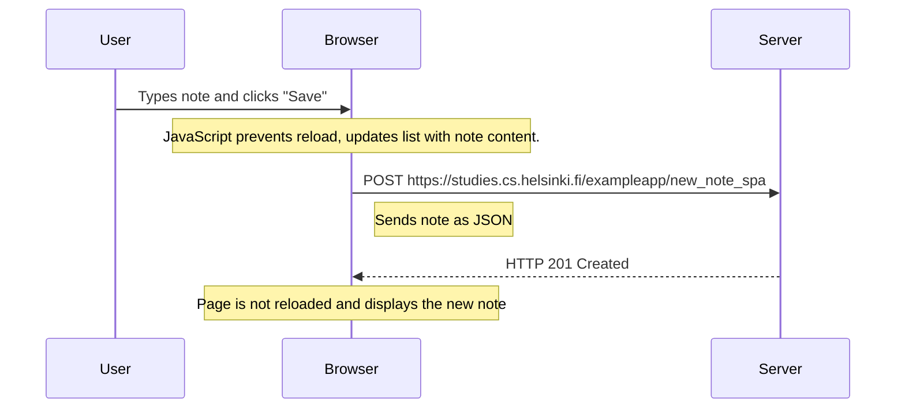

```mermaid
sequenceDiagram
    participant User
    participant Browser
    participant Server

    User->>Browser: Types note and clicks "Save"
    Note over Browser: JavaScript prevents reload, updates list with note content.

    Browser->>Server: POST  https://studies.cs.helsinki.fi/exampleapp/new_note_spa
    Note right of Browser: Sends note as JSON

    Server-->>Browser: HTTP 201 Created
    Note over Browser: Page is not reloaded and displays the new note
```